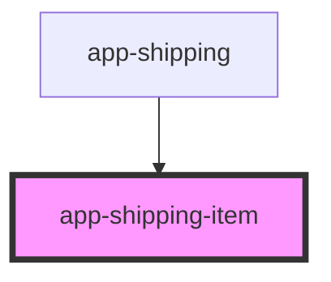

# app-shipping-item

<!-- Auto Generated Below -->

## Properties

| Property                 | Attribute                  | Description | Type                                | Default     |
| ------------------------ | -------------------------- | ----------- | ----------------------------------- | ----------- |
| `name`                   | `name`                     |             | `"aramex" \| "dhl" \| "fedex"`      | `undefined` |
| `onChangeShippingMethod` | --                         |             | `(string: ShippingMethods) => void` | `undefined` |
| `pic`                    | `pic`                      |             | `string`                            | `undefined` |
| `price`                  | `price`                    |             | `number`                            | `undefined` |
| `selectedShippingMethod` | `selected-shipping-method` |             | `"aramex" \| "dhl" \| "fedex"`      | `undefined` |

## Dependencies

### Used by

 - [app-shipping](../app-shipping)

### Graph

----------------------------------------------

*Built with [StencilJS](https://stenciljs.com/)*
